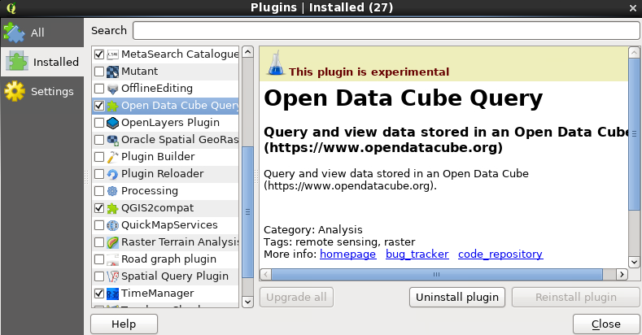
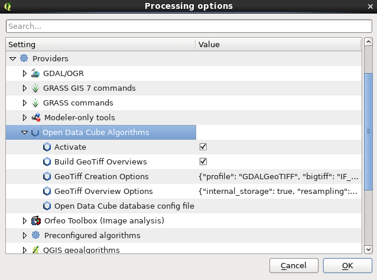
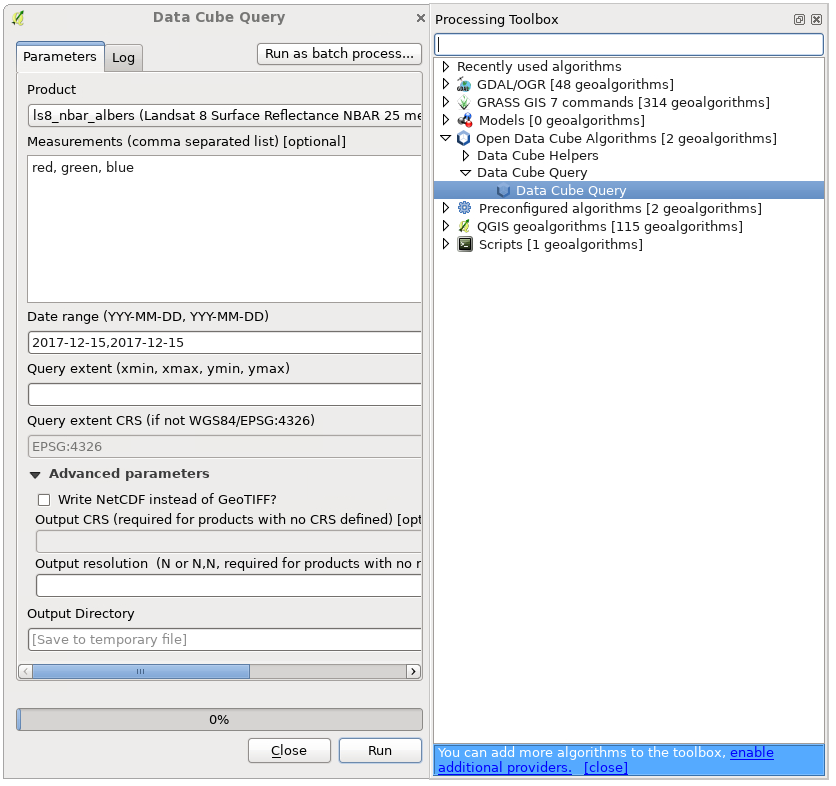

# dea-datacube-qgis
DEA Specific Data Cube QGIS Plugin source


## NCI VDI instructions
 1. Start a [VDI session](https://opus.nci.org.au/display/Help/VDI+User+Guide)
 2. In a command prompt:
  
```
module use /g/data/v10/public/modules/modulefiles
module load dea-qgis2-prod
qgis
```

 3. In QGIS enable and activate the plugin:
   	- Plugins menu -> Manage and Install Plugins -> Installed -> Open Data Cube Query
  	- Processing menu -> Providers -> Open Data Cube Query Algorithms -> activate
    - The tools will be available from the Processing toolbox







     
